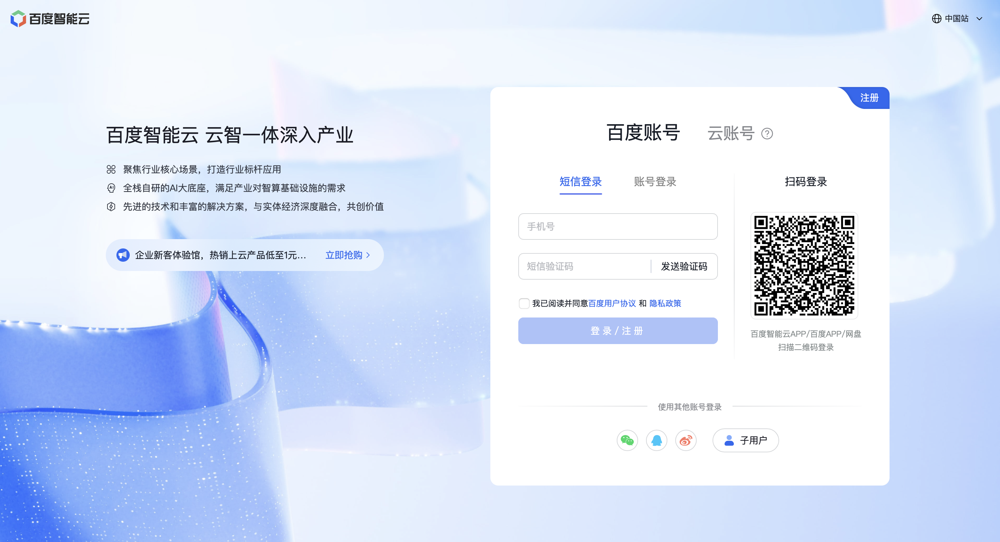
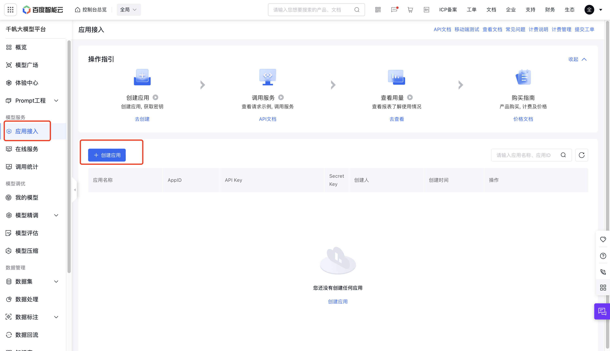
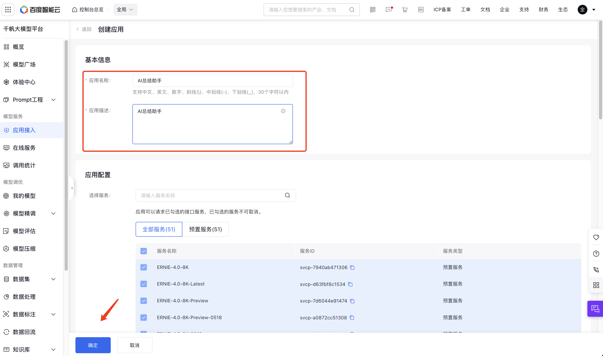
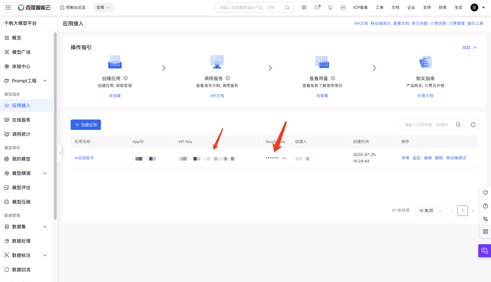
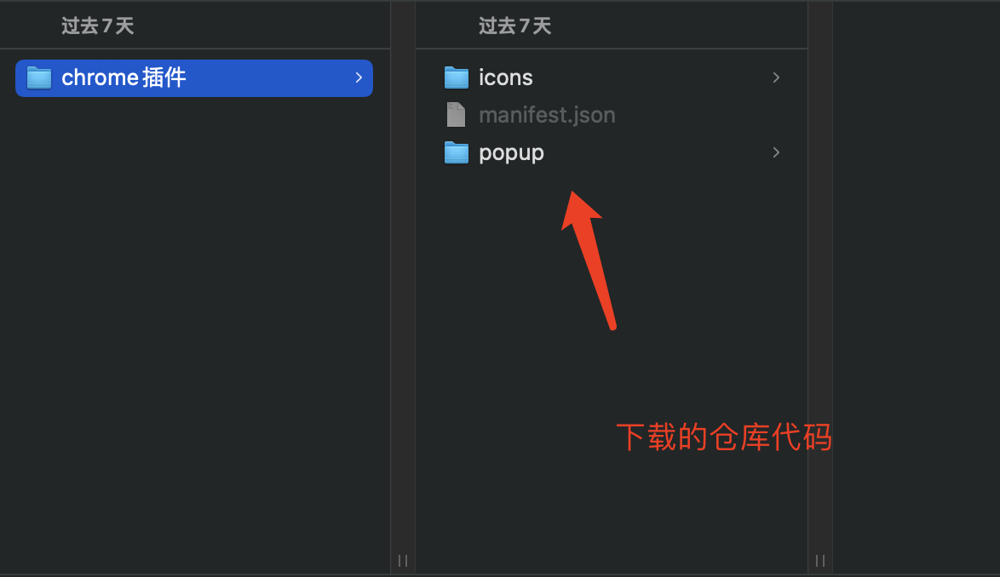
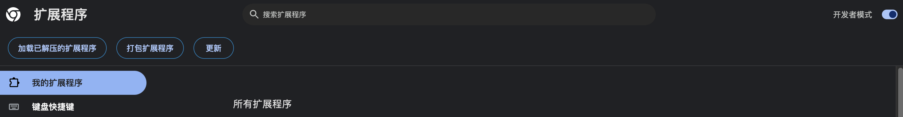
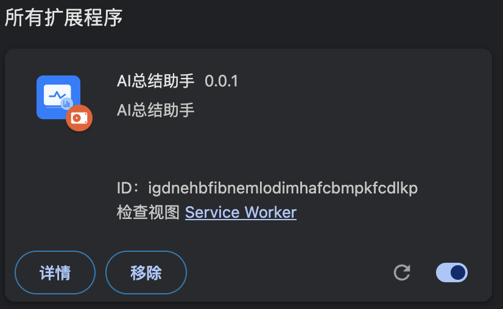
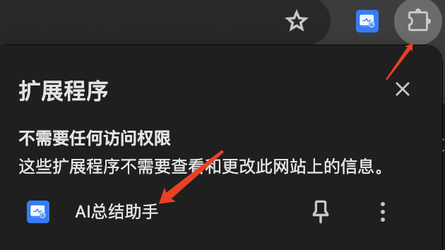
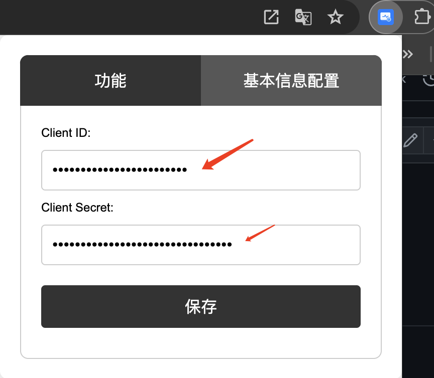
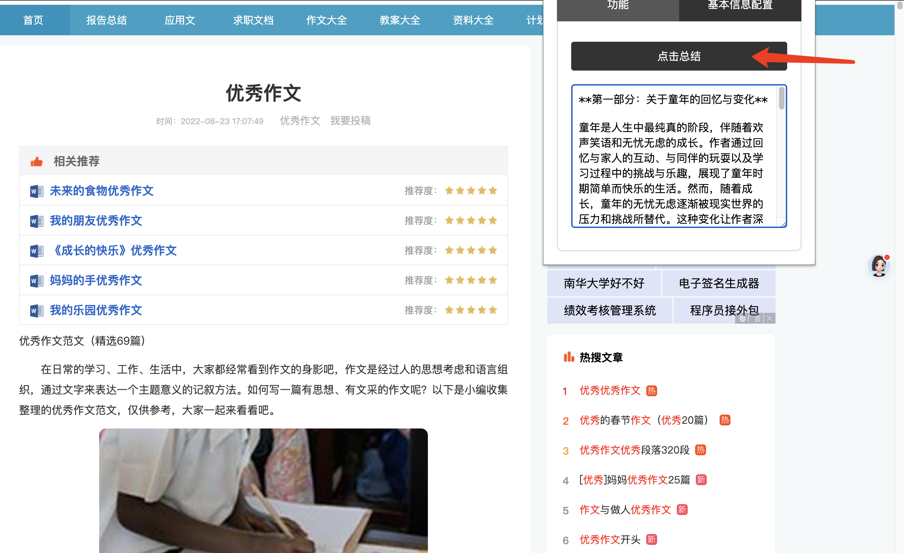

<h1 align="center">AI总结助手Chrome插件应用</h1>

仅支持百度千帆大模型 **ERNIE-Speed-128K** （免费版）

## 隐私声明

该项目高度重视隐私，致力于保护其用户的隐私。该项目不会以任何方式收集、记录或存储用户输入的任何文本或由百度千帆服务器返回的任何文本。

## 更新日志

- **2024年7月25日** 仅支持百度千帆免费版“ERNIE-Speed-128K”模型。

## 特点

1. 支持百度千帆“ERNIE-Speed-128K”模型（免费版）
2. 支持百度千帆 AppID和 API Key配置
3. 个人完全免费使用。

## 如何使用

- 注册并登录千帆大模型平台，地址：https://console.bce.baidu.com/qianfan/ais/console/applicationConsole/application

  

- 创建应用

  

- 输入“AI总结助手”保存

  

- 查看API Key（对应配置：Client ID）和Secret Key（对应配置：Client Secret），进行保存

  

- 下载本地仓库内容

- 打开chrome浏览器，点击管理扩展程序，打开开发者模式

  

- 点击“加载已解压的扩展程序”选中下载的仓库代码文件夹，保存

  

- 于是在chorme浏览器插件位置出现“AI总结助手”图标

  

- 点击“AI总结助手”，选择“基本信息配置”选项卡，输入Client ID（对应千帆应用API Key）和Client Secret（对应千帆应用Secret Key），保存

- 使用，例如打开https://www.fwsir.com/fanwen/html/fanwen_20220602080055_1821646.html,并点击总结按钮，则会在下面的输入框中显示总结内容

